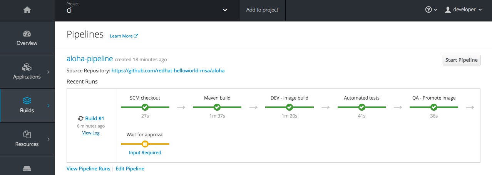

// JBoss, Home of Professional Open Source
// Copyright 2016, Red Hat, Inc. and/or its affiliates, and individual
// contributors by the @authors tag. See the copyright.txt in the
// distribution for a full listing of individual contributors.
//
// Licensed under the Apache License, Version 2.0 (the "License");
// you may not use this file except in compliance with the License.
// You may obtain a copy of the License at
// http://www.apache.org/licenses/LICENSE-2.0
// Unless required by applicable law or agreed to in writing, software
// distributed under the License is distributed on an "AS IS" BASIS,
// WITHOUT WARRANTIES OR CONDITIONS OF ANY KIND, either express or implied.
// See the License for the specific language governing permissions and
// limitations under the License.

## Use case: CI/CD Pipeline

### Deploy Jenkins

Install a custom Jenkins image (needs an admin privilege)

----
$ oc login -u system:admin
$ oc project openshift
$ oc adm policy add-cluster-role-to-user cluster-admin system:serviceaccount:ci:jenkins -n ci
$ oc create -f https://raw.githubusercontent.com/redhat-helloworld-msa/jenkins/master/custom-jenkins.build.yaml
$ oc start-build custom-jenkins-build --follow
----

Install the Jenkins/OpenShift Pipeline BuildConfig in another project

----
$ oc login -u developer -p developer
$ oc new-project ci
$ oc create -f https://raw.githubusercontent.com/redhat-helloworld-msa/aloha/master/pipeline.yml
$ oc project helloworld-msa
----

Once approved, the fixed project will be applied to the `"production"`.

- First introduce `an error` in the production.

----
$ cd aloha/
$ vim src/main/java/com/redhat/developers/msa/aloha/AlohaVerticle.java

#  replace  return String.format("Aloha mai %s", hostname);
#  by       return String.format("Aloca mai %s", hostname);
----

- Deploy the erroneous version in the production area.

----
$ mvn clean package; oc start-build aloha --from-dir=. --follow
----

Now Browse to the `ci` project and select `Builds` -> `Pipelines` in the lateral menu.
Click on the gray button called `Start Pipeline`.

The projects `helloworld-msa-dev` and `helloworld-msa-qa` will be created automatically according to the link:https://github.com/redhat-helloworld-msa/aloha/blob/master/Jenkinsfile[defined Pipeline].

You will need to manually approve the deployment to production.

