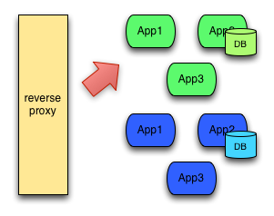
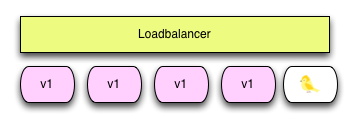

// JBoss, Home of Professional Open Source
// Copyright 2016, Red Hat, Inc. and/or its affiliates, and individual
// contributors by the @authors tag. See the copyright.txt in the
// distribution for a full listing of individual contributors.
//
// Licensed under the Apache License, Version 2.0 (the "License");
// you may not use this file except in compliance with the License.
// You may obtain a copy of the License at
// http://www.apache.org/licenses/LICENSE-2.0
// Unless required by applicable law or agreed to in writing, software
// distributed under the License is distributed on an "AS IS" BASIS,
// WITHOUT WARRANTIES OR CONDITIONS OF ANY KIND, either express or implied.
// See the License for the specific language governing permissions and
// limitations under the License.

== Use case: Deployment Patterns

=== Blue/Green deployment

Blue/Green deployment is a technique where two different environments/versions (Blue and Green) of the same application  are running in parallel but only one of them is receiving requests from the router at a time.

To release a new version, the router is updated to switch between the "Blue" environment and point to the "Green" environment.

We can use 2 different approaches to perform Blue/Gren deployment:

- Changing the Routes
- Changing the Services

==== Blue/Green deployment using Routes

This strategy is based on link:https://github.com/openshift/origin/tree/master/examples/deployment#blue-green-deployment[Openshift deployment examples] and it uses the `API-Gateway` project, but it could be used with any other project:

- Modify the service.
----
$ cd /api-gateway

$ vim src/main/java/com/redhat/developers/msa/api_gateway/CamelRestEndpoints.java

# replace .transform().body(List.class, list -> list)
# by      .transform().body(List.class, list -> list.stream().map(res -> "UPDATED - " + res).collect(java.util.stream.Collectors.toList()))
----

- Create a `"new"` version of the application using a **different name**..
----
$ oc new-build --binary --name=api-gateway-blue -l app=api-gateway-blue
$ mvn package && oc start-build api-gateway-blue --from-dir=. --follow
$ oc new-app api-gateway-blue -l app=api-gateway-blue,hystrix.enabled=true
----

- Enable Readiness probe
----
$ oc set probe dc/api-gateway-blue --readiness --get-url=http://:8080/health
----

- Switch the route to the `"new"` application.
----
$ oc patch route/api-gateway -p '{"spec": {"to": {"name": "api-gateway-blue" }}}'

# To return to the "old" application
$ oc patch route/api-gateway -p '{"spec": {"to": {"name": "api-gateway" }}}'
----

- (Optional) Remove the "old" version.
----
$ oc delete is,bc,dc,svc api-gateway
$ oc delete builds -l build=api-gateway
----

==== Blue/Green deployment using Services

This approach is more suitable for Services with internal access only. It will modify the existing Kubernetes Service to point to the new DeploymentConfig

- Modify the service.
----
$ cd /bonjour

$ vim lib/api.js 

# go to line 32
# replace  const sayBonjour = () => `Bonjour de ${os.hostname()}`;
# by       const sayBonjour = () => `Version 2 - Bonjour de ${os.hostname()}`;
----

- Create a `"new"` version of the application using a **different name**.
----
$ oc new-build --binary --name=bonjour-new
$ npm install && oc start-build bonjour-new --from-dir=. --follow
$ oc new-app bonjour-new
----

- Enable Readiness probe
----
$ oc set probe dc/bonjour-new --readiness --get-url=http://:8080/api/health
----

- Switch the Service to the `"new"` application.
----
$ oc patch svc/bonjour -p '{"spec":{"selector":{"app":"bonjour-new","deploymentconfig":"bonjour-new"}}}'

# To return to the "old" application
$ oc patch svc/bonjour -p '{"spec":{"selector":{"app":"bonjour","deploymentconfig":"bonjour"}}}'
----

=== Canary deployments

Canary deployments are a way of sending out a new version of your app into production that plays the role of a “canary” to get an idea of how it will perform (integrate with other apps, CPU, memory, disk usage, etc). Canary releases let you test the waters before pulling the trigger on a full release.

This strategy is based on link:https://github.com/openshift/origin/tree/master/examples/deployment#rolling-deployments-with-canary-checks[Openshift deployment examples] and it uses the `Bonjour` project, but it could be used with any other project:

- Modify the service.
----
$ cd /bonjour

$ vim lib/api.js 

# go to line 32
# replace  const sayBonjour = () => `Bonjour de ${os.hostname()}`;
# by       const sayBonjour = () => `Version 2 - Bonjour de ${os.hostname()}`;
----

- Create a `"new"` version of the application using a **different name**..
----
$ oc new-build --binary --name=bonjour-new
$ npm install && oc start-build bonjour-new --from-dir=. --follow
$ oc new-app bonjour-new
----

- Enable Readiness probe
----
$ oc set probe dc/bonjour-new --readiness --get-url=http://:8080/api/health
----

- Apply a common label (svc=canary-bonjour) for both versions
----
$ oc patch dc/bonjour -p '{"spec":{"template":{"metadata":{"labels":{"svc":"canary-bonjour"}}}}}'
$ oc patch dc/bonjour-new -p '{"spec":{"template":{"metadata":{"labels":{"svc":"canary-bonjour"}}}}}'
----

- Update the Service to point to the new label
----
$ oc patch svc/bonjour -p '{"spec":{"selector":{"svc":"canary-bonjour","app": null, "deploymentconfig": null}, "sessionAffinity":"ClientIP"}}'
----

- Simulate multiple clients
----
$ oc scale dc/bonjour --replicas=3

# Simulate 10 new clients and note that 25% of the requests are made on bonjour-new.
$ for i in {1..10}; do curl http://bonjour-helloworld-msa.`minishift ip`.nip.io/api/bonjour ; echo ""; done;

# Simulate the same client
$ curl -b cookies.txt -c cookies.txt  http://bonjour-helloworld-msa.$(minishift ip).nip.io/api/bonjour

# To change the credentials, delete the cookies file
$ rm cookies.txt
----

- To return to the original state
----
$ oc scale dc/bonjour --replicas=1
$ oc delete all -l app=bonjour-new
$ oc patch svc/bonjour -p '{"spec":{"selector":{"svc":null ,"app": "bonjour", "deploymentconfig": "bonjour"}, "sessionAffinity":"None"}}'
----