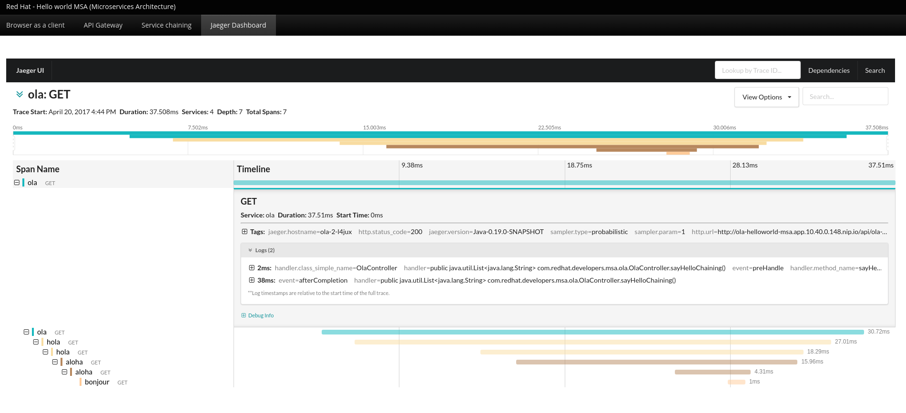

// JBoss, Home of Professional Open Source
// Copyright 2016, Red Hat, Inc. and/or its affiliates, and individual
// contributors by the @authors tag. See the copyright.txt in the
// distribution for a full listing of individual contributors.
//
// Licensed under the Apache License, Version 2.0 (the "License");
// you may not use this file except in compliance with the License.
// You may obtain a copy of the License at
// http://www.apache.org/licenses/LICENSE-2.0
// Unless required by applicable law or agreed to in writing, software
// distributed under the License is distributed on an "AS IS" BASIS,
// WITHOUT WARRANTIES OR CONDITIONS OF ANY KIND, either express or implied.
// See the License for the specific language governing permissions and
// limitations under the License.

### Deploy Jaeger

http://uber.github.io/jaeger/[Jaeger] is a fully compatible http://www.opentracing.io[OpenTracing] distributed tracing system.
It helps gather timing data needed to troubleshoot latency problems in microservice architectures.

The https://github.com/uber/jaeger[jaeger project] provides all the required resources to start the Jaeger components to trace your microservices.

The figure shows a trace detail view for one invocation of the service chaining.
We can see the invocation start time, total duration, number of services being invoked and also
a total number of spans (an operation in the system).

The showed timeline view allows us to understand
relationships between invocations (serial vs parallel) and examine durations of these operations.
A span also carries contextual logs and tags which can be queried. Each line represents one span so
we can drill down to and see what happened at an operation level in the monitored system.

#### Deploy using oc CLI

Execute:

----
$ oc process -f https://raw.githubusercontent.com/jaegertracing/jaeger-openshift/0.1.2/all-in-one/jaeger-all-in-one-template.yml | oc create -f -
$ oc env dc -l app JAEGER_SERVER_HOSTNAME=jaeger-all-in-one  # redeploy all services with tracing
----

#### Enable the Jaeger Dashboard in the Frontend

Execute:
----
$ oc env dc/frontend ENABLE_JAEGER=true
----

#### Test the Jaeger console

Access: http://jaeger-helloworld-msa.<openshift-domain>/

