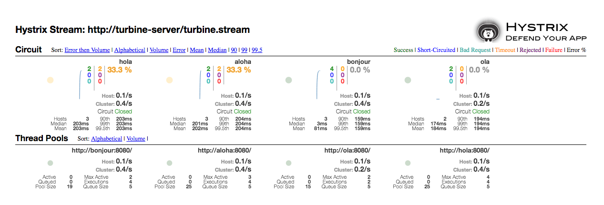

// JBoss, Home of Professional Open Source
// Copyright 2016, Red Hat, Inc. and/or its affiliates, and individual
// contributors by the @authors tag. See the copyright.txt in the
// distribution for a full listing of individual contributors.
//
// Licensed under the Apache License, Version 2.0 (the "License");
// you may not use this file except in compliance with the License.
// You may obtain a copy of the License at
// http://www.apache.org/licenses/LICENSE-2.0
// Unless required by applicable law or agreed to in writing, software
// distributed under the License is distributed on an "AS IS" BASIS,
// WITHOUT WARRANTIES OR CONDITIONS OF ANY KIND, either express or implied.
// See the License for the specific language governing permissions and
// limitations under the License.

### Deploy Kubeflix

https://github.com/fabric8io/kubeflix[Kubeflix] provides http://kubernetes.io/[Kubernetes] integration with https://netflix.github.io/[Netflix] open source components such as https://github.com/Netflix/Hystrix[Hystrix], https://github.com/Netflix/Turbine[Turbine] and https://github.com/Netflix/Ribbon[Ribbon].

Specifically it provides:

* Kubernetes Instance Discovery for Turbine and Ribbon
* Kubernetes configuration and images for Turbine Server and Hystrix Dashboard

#### Deploy using oc CLI

Execute:

----
$ oc process -f http://central.maven.org/maven2/io/fabric8/kubeflix/packages/kubeflix/1.0.17/kubeflix-1.0.17-kubernetes.yml | oc create -f -
$ oc expose service hystrix-dashboard --port=8080
$ oc policy add-role-to-user admin system:serviceaccount:helloworld-msa:turbine
----

#### Enable the Hystrix Dashboard in the Frontend

Execute:
----
$ oc env dc/frontend ENABLE_HYSTRIX=true
----

#### Test the hystrix-dashboard

Access: http://hystrix-dashboard-helloworld-msa.<openshift-domain>/

