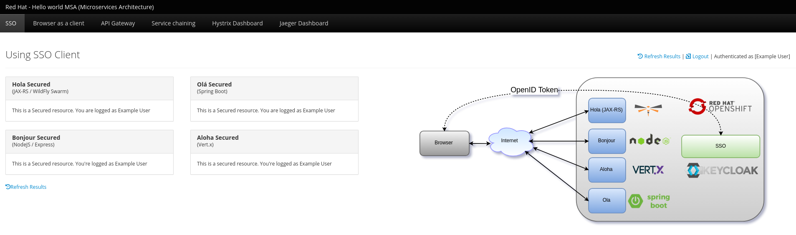

// JBoss, Home of Professional Open Source
// Copyright 2016, Red Hat, Inc. and/or its affiliates, and individual
// contributors by the @authors tag. See the copyright.txt in the
// distribution for a full listing of individual contributors.
//
// Licensed under the Apache License, Version 2.0 (the "License");
// you may not use this file except in compliance with the License.
// You may obtain a copy of the License at
// http://www.apache.org/licenses/LICENSE-2.0
// Unless required by applicable law or agreed to in writing, software
// distributed under the License is distributed on an "AS IS" BASIS,
// WITHOUT WARRANTIES OR CONDITIONS OF ANY KIND, either express or implied.
// See the License for the specific language governing permissions and
// limitations under the License.

# Helloworld-MSA (Microservices architecture)
http://developers.redhat.com
:toc: macro
:toc-title: Table of Contents
:toclevels: 3
:icons: font
:data-uri:
:source-highlighter: coderay

This content is brought to you by http://developers.redhat.com - Register today!

Latest HTML:
http://bit.ly/msa-instructions

This is the frontend screenshot that you will see after the deployment of all microservices:

toc::[]

include::prepare-env.adoc[]

include::ansible.adoc[]

## (Option 2) Install each microservice individually

include::create-project.adoc[]

include::hola.adoc[]

include::aloha.adoc[]

include::ola.adoc[]

include::bonjour.adoc[]

include::api-gateway.adoc[]

include::frontend.adoc[]

include::kubeflix.adoc[]

include::jaeger.adoc[]

include::sso.adoc[]

include::config.adoc[]

include::deployments.adoc[]

include::cicd.adoc[]

include::troubleshooting.adoc[]

